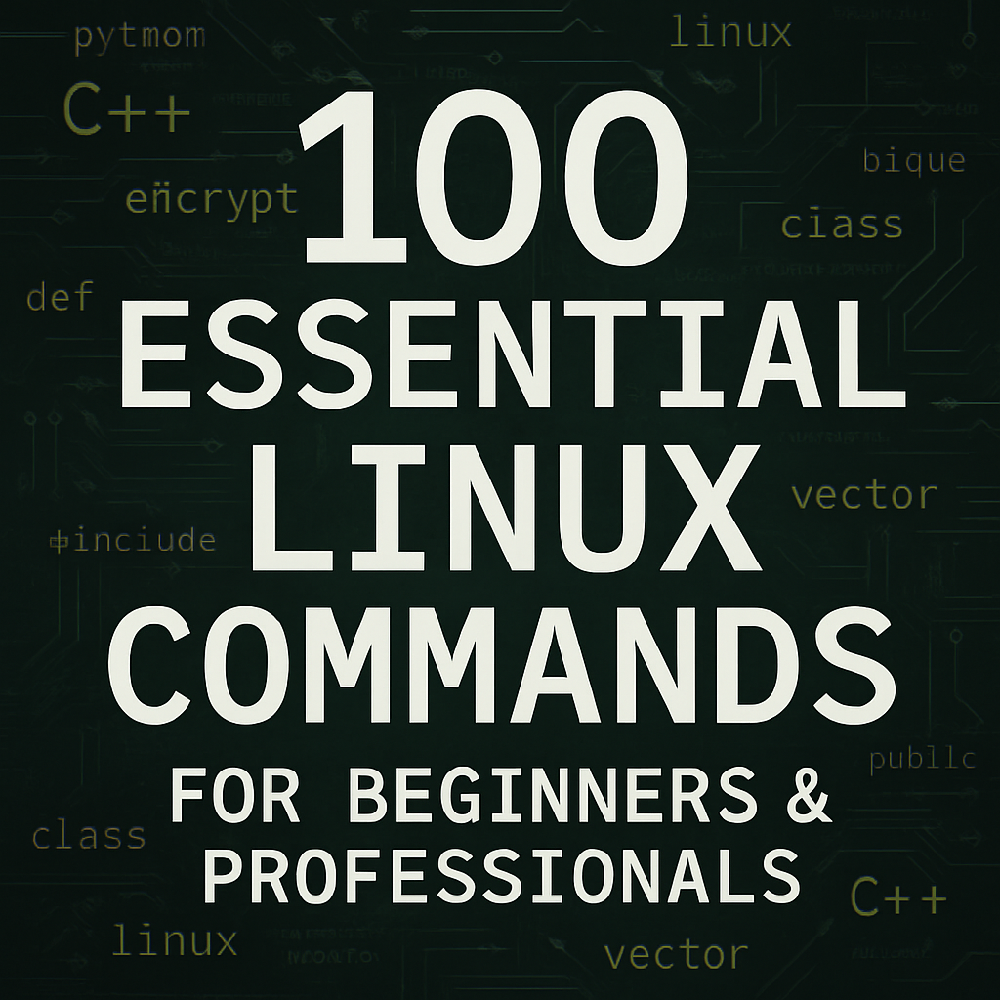

🔗 برای راهنمای فارسی اینجا را کلیک کنید → [Click here](README_FA.md)

  

# 💻 100 Basic Linux Commands

📂 A complete bilingual reference for the most essential and practical Linux terminal commands, suitable for learning, practice, and real-world use.

---

## 📁 Included Files

| File Name                              | Description |
|----------------------------------------|-------------|
| `linux_100_commands_persian.md`       | 100 Persian commands with structured markdown format |
| `linux_100_commands_english.md`        | 100 English commands with structured markdown format |

---

## 🎯 Who Is This For?

- 🧑‍💻 Beginner Linux users
- 🛠️ Developers and DevOps professionals
- 🧑‍🏫 Computer science & IT educators and students
- 🌐 Anyone seeking a clean bilingual Linux reference

---

## ✨ Features

- ✅ Neatly formatted in Markdown
- ✅ Includes real-world examples and terminal outputs
- ✅ Ideal for building cheatsheets or personal reference
- ✅ Fully translated and ready for global use

---

## 📧 Contact Me

Created with ❤️ by **Esmail Zolfaghari**

- Email: esmailprogramer@gmail.com  
- [Telegram](https://t.me/anon7vip)  
- [LinkedIn](https://www.linkedin.com/in/esmail-zolfghari-0b4926337)

---
