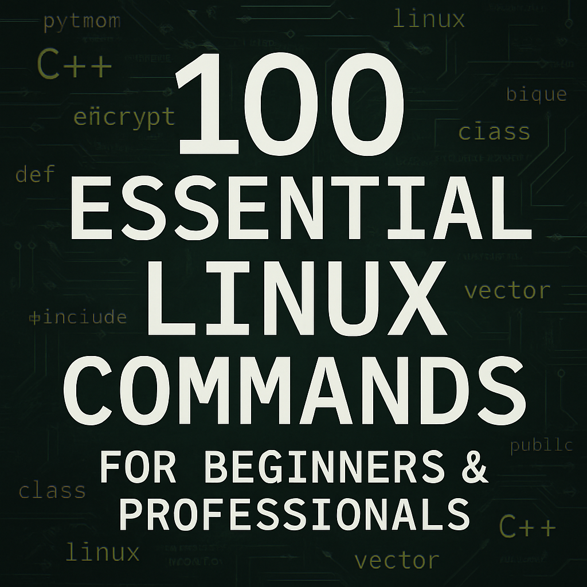

  

🔗 → For Persian Readme [Click Here](README_FA.md)
# 💻 ۱۰۰ دستور ابتدایی لینوکس

📂 مرجع کامل و کاربردی برای مهم‌ترین دستورات ترمینال لینوکس به زبان فارسی و انگلیسی، مناسب برای یادگیری، تمرین، و استفاده در محیط واقعی.

---

## 📁 فایل‌های موجود

| نام فایل                                | توضیح |
|----------------------------------------|-------|
| `linux_100_commands_persian.md`       | ۱۰۰ دستور به زبان فارسی با فرمت آموزشی مرتب‌شده |
| `linux_100_commands_english.md`        | ۱۰۰ دستور به زبان انگلیسی با فرمت آموزشی مرتب‌شده |

---

## 🎯 این پروژه برای چه کسانی مناسب است؟

- 🧑‍💻 کاربران مبتدی لینوکس
- 🛠️ برنامه‌نویسان و افراد فعال در حوزه DevOps
- 🧑‍🏫 اساتید و دانشجویان رشته مهندسی کامپیوتر و فناوری اطلاعات

---

## ✨ ویژگی‌ها

- ✅ فرمت زیبا و خوانا با Markdown
- ✅ دارای مثال واقعی و خروجی ترمینال
- ✅ مناسب برای ساخت چیت‌شیت یا جزوه شخصی

---

## 📧 ارتباط با من

ساخته شده با ❤️ توسط **اسماعیل ذوالفقاری**

- ایمیل: esmailprogramer@gmail.com  
- [تلگرام](https://t.me/anon7vip)  
- [لینکدین](https://www.linkedin.com/in/esmail-zolfghari-0b4926337)

---
